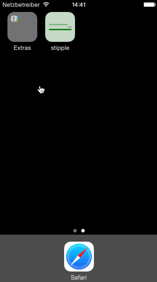

# Tip Calculator App

This is an iOS demo application for calculating tips at restaurants.

**Time spent:** 20 hours (started with wrong assignment :( )

## Completed User Stories

 * [x] *required* -- basic tip calculator functionality
 * [x] *required* -- settings page for default tip percentage
 * [x] *optional* -- bill amount remembered between runs, w/10 minute expiry
 * [x] *optional* -- locale specific currency display and input
 * [x] *extra* -- tilt device to change tip percentage ("tip to tip")
 * [x] *extra* -- styled with colors, fonts, AppIcon, and LaunchImage (from working on wrong assignment)
 

## Notes

* made good use of extensions to include new functionality into views and controllers (see `extensions.swift`)
* created a `SettingsModel` with getters and setters which made persistent settings very natural
* created a `MotionModel` which uses the delegate pattern to report device tilt

## Walkthrough of All User Stories

GIF created with [LiceCap](http://www.cockos.com/licecap/).

